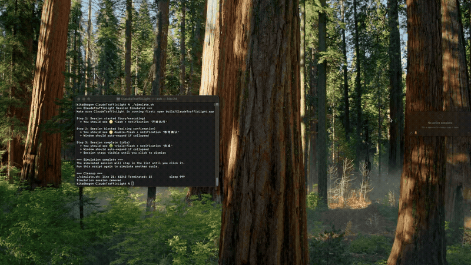
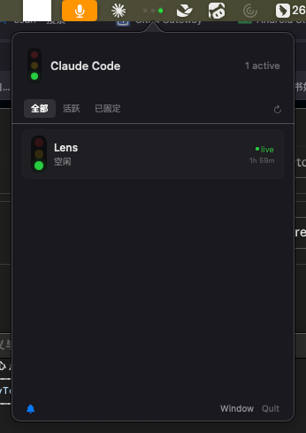
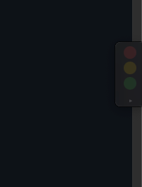
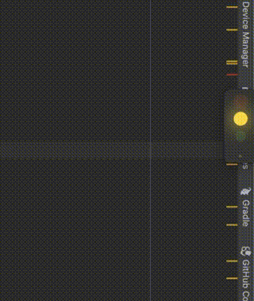
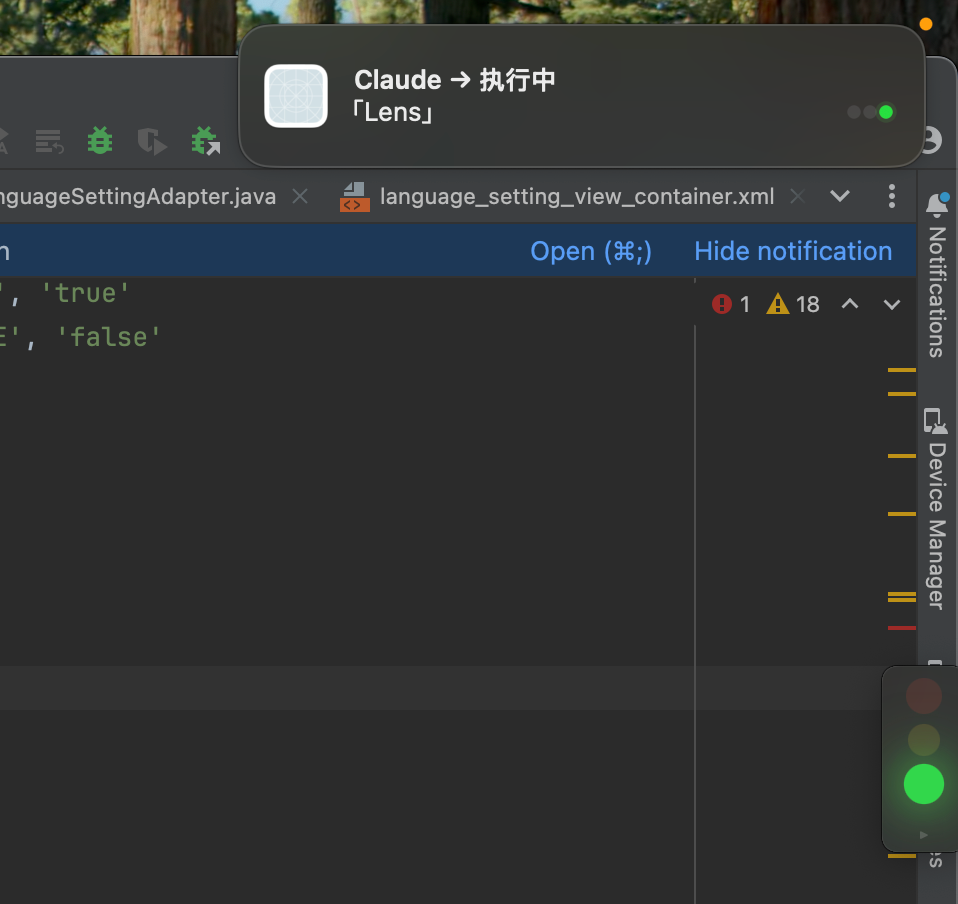

# 🚦 Claude Traffic Light

> Claude Code 会话监控 + 强提醒工具，专为 macOS 设计。

当你同时运行多个 Claude Code 会话时，**Claude Traffic Light** 让你一眼看清谁在思考、谁在等你确认、谁出错了。安静时不打扰，关键时刻强提醒。

---

### 🎬 全景演示



---

## ✨ 特性

- **双模式运行** — 悬浮窗口实时一览 + 菜单栏红绿灯图标
- **⌚ 实时状态监控** — Claude Hooks 主动上报，JSON + JSONL 解析作为回退
- **🔴 错误识别** — 区分 API/工具错误与权限等待，避免文本关键词误报
- **🔔 强提醒** — 菜单栏图标闪烁 + macOS 系统通知（状态变化、等待确认、出错即时推送）
- **📌 会话固定** — Pin 住重要会话，完成后保留不消失
- **🥃 毛玻璃悬浮窗** — HUD 风格半透明窗口，圆角毛玻璃背景，自动适应内容高度
- **↔️ 侧边吸附折叠** — 拖到屏幕边缘自动收折为竖排红绿灯条，拖走自动展开
- **🫁 呼吸灯动画** — 活跃中的红绿灯柔光呼吸效果
- **🔍 三标签筛选** — 全部 / 活跃 / 已固定，右键复制会话 ID
- **🔕 通知开关** — 菜单栏底部一键关闭/开启通知
- **🎯 零权限** — 使用 `NSUserNotification`，无需系统通知授权
- **📝 双行标题** — Agent 自动总结标题 + 用户首次提问预览

---

## 🖼️ 功能截图

### 菜单栏面板 — 全部 / 活跃 / 已固定 三标签筛选



### 悬浮窗 — 毛玻璃卡片 + 呼吸灯



### 红绿灯折叠态 — 拖到屏幕边缘自动吸附

<p align="center">
  
</p>

### macOS 系统通知 — 零权限弹窗



---

## 🖥️ 系统要求

- macOS 13.0+
- Apple Silicon（arm64）

---

## 📦 安装 & 构建

```bash
# 克隆仓库
git clone https://github.com/xiaxiao5946/ClaudeTrafficLight.git
cd ClaudeTrafficLight

# 构建
bash build.sh

# 运行
open build/ClaudeTrafficLight.app
```

构建产物在 `build/ClaudeTrafficLight.app`，可直接拖入 Applications 文件夹。

### 安装 Claude Hooks（推荐）

```bash
node Scripts/claude-status-hook.js --install
```

安装命令会保留现有配置，并更新 `~/.claude/settings.json`。新建或恢复 Claude
Code 会话时，Hook 会自动启动本应用；未安装 Hook 时仍会使用 JSON 和 JSONL 检测状态。

---

## 🎮 使用方式

| 操作 | 效果 |
|------|------|
| 点击菜单栏 🚦 图标 | 打开/关闭 Popover 面板 |
| 在 Popover 中点击会话 | 查看详情 / 消除已完成会话 |
| 右键会话行 | 复制会话 ID / 固定/取消固定 |
| 拖拽悬浮窗口到屏幕边缘 | 自动吸附折叠为红绿灯条 |
| 拖拽悬浮窗口离开屏幕边缘 | 自动展开为卡片视图 |
| 双击折叠的红绿灯条 | 展开悬浮窗口 |
| 移开鼠标（展开状态靠边时） | 1.5 秒后自动折叠 |
| 底部 Pin 图标 | 切换窗口置顶 |
| 底部 Bell 图标 | 开关系统通知 |

---

## 🏗️ 架构

```
Sources/ClaudeTrafficLight/
├── main.swift              # 入口、AppDelegate、悬浮窗
├── SessionMonitor.swift    # 会话发现、状态解析、Pin 管理
├── Models.swift            # SessionInfo / SessionStatus 模型
├── TrafficLightIcon.swift  # 红绿灯图标绘制（菜单栏 / 通知 / App 图标）
├── PopoverView.swift       # 菜单栏 Popover 面板
├── SessionRow.swift        # 会话列表行视图
└── SessionDetailView.swift # 会话详情卡片
```

**状态检测链路：**

```
~/.claude/sessions/*.json (pid + status)
     ↓
kill(pid, 0) → 进程存活
     ↓
~/.claude/projects/-cwd-/*.jsonl (最后一行时间戳 < 30s)
     ↓
assistant/tool_use → 🛠️ working
assistant/recent    → 👁️ thinking
system/permission   → ⏸️ blocked
else                → ✅ idle
```

---

## 🔧 模拟测试

```bash
# 状态判定 + Hook 安装自检
bash test.sh

# 启动模拟：创建一个假会话并在 10 秒内经历 忙碌→阻塞→完成
bash simulate.sh
```

---

## 📄 License

MIT
